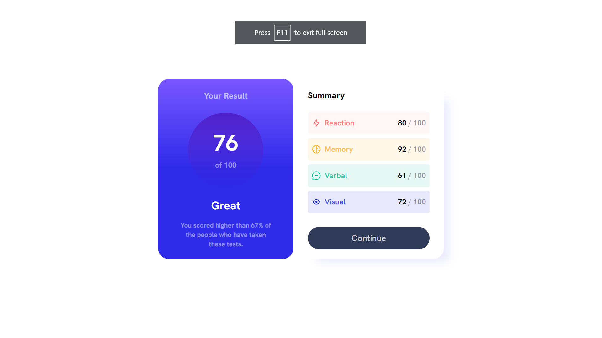

# Frontend Mentor - Results summary component solution

This is a solution to the [Results summary component challenge on Frontend Mentor](https://www.frontendmentor.io/challenges/results-summary-component-CE_K6s0maV). Frontend Mentor challenges help you improve your coding skills by building realistic projects.

## Table of contents

-   [Overview](#overview)
    -   [The challenge](#the-challenge)
    -   [Screenshot](#screenshot)
    -   [Links](#links)
-   [My process](#my-process)
    -   [Built with](#built-with)
    -   [What I learned](#what-i-learned)
    -   [Continued development](#continued-development)
    -   [Useful resources](#useful-resources)

## Overview

The challenge is building out a results summary component and getting it as close to the design as possible. For this challenge I attempted to use Tailwindcss for the first time.

### The challenge

Users should be able to:

-   View the optimal layout for the interface depending on their device's screen size
-   See hover and focus states for all interactive elements on the page

### Screenshot

### Links

-   Solution URL: https://www.frontendmentor.io/solutions/responsive-component-using-tailwindcss-bK09BzMNWC
-   Live Site URL: https://dlee1993.github.io/FEM-results_summary_component/

## My process

For this challenge my process was fairly straight forward, I initially split the challenge into two parts, the results section and the summary section. Firstly I styled the responsive layout for the overall component using flexbox, that takes care of the mobile and desktop layout, for this challenge the layout is straight forward as the only pieces of the component that change layout are the results and summary sections, all other text stays the same. I then added and styled the jsx for the results section of the component. I also did the same for the summart section with a slight change, I decided to break out the icons into their own components and added them to the SVG-components file and imported them into the app.jsx.

### Built with

-   Semantic HTML5 markup
-   Tailwindcss
-   Flexbox
-   Mobile-first workflow
-   [React](https://reactjs.org/) - JS library

### What I learned

For this challenge my main focus point of learning was tailwindcss, this challenge gave me the opportunity to start understanding how to use utility classes with responsive design in mind.

### Continued development

I am going to continue to use tailwind to grow and develop my understanding. I also aim to better my understanding of react best practices

### Useful resources

-   Tailwindcss Docs (https://www.tailwindcss.com) - This helped me understand how to implement gradients and boxshadows with utility classes

## Author

-   Frontend Mentor - https://www.frontendmentor.io/profile/DLee1993
